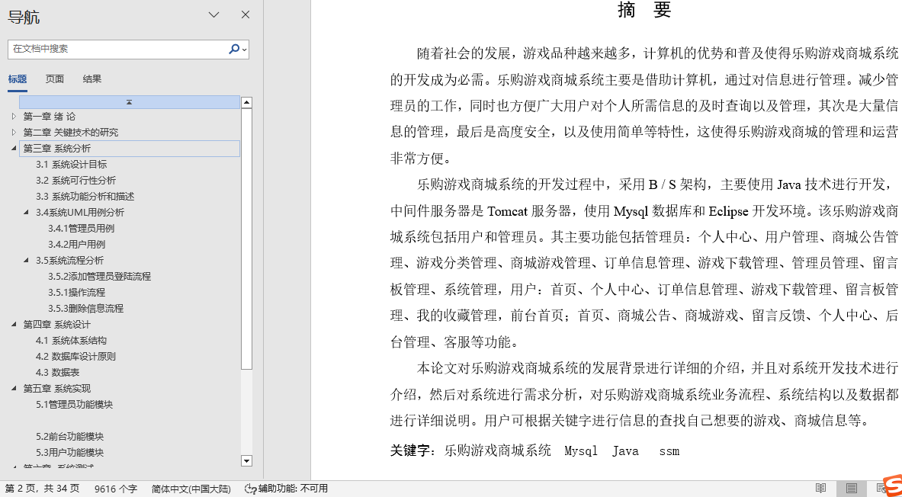
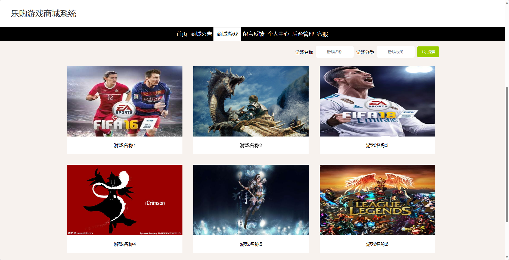
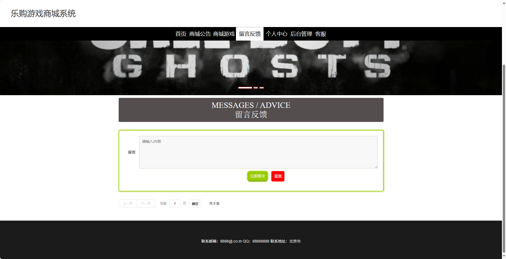
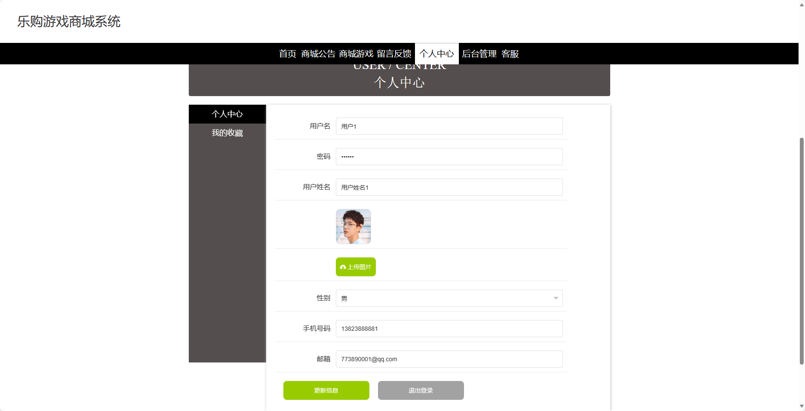
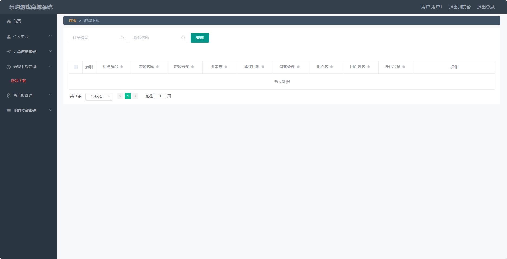
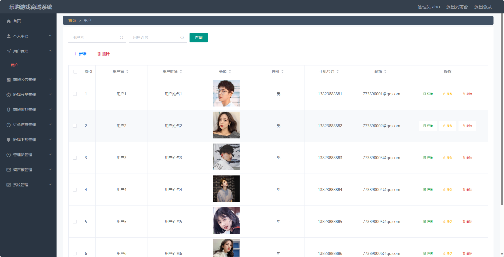
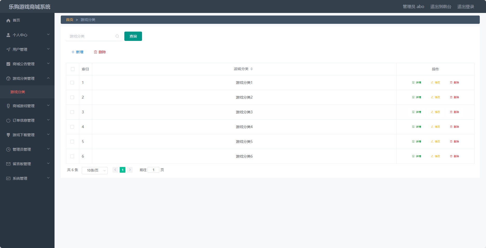
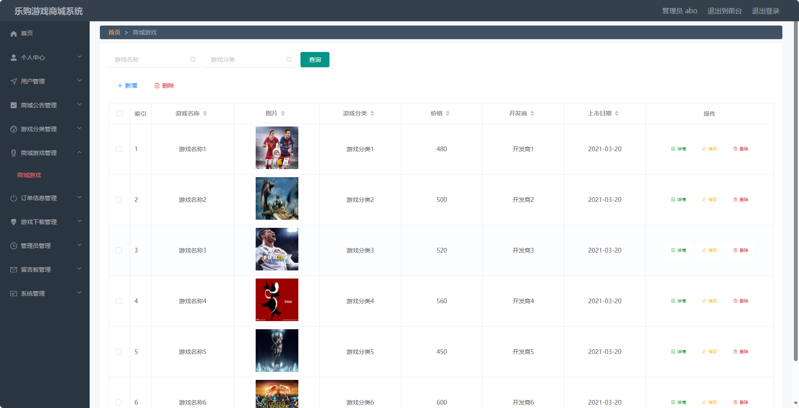

## 基于SSM框架实现的乐购游戏商城系统(程序+报告)

- <b>完整代码获取地址：从戎源码网 ([https://armycodes.com/](https://armycodes.com/))</b>
- <b>技术探讨、资料分享，请加QQ群：692619798</b> 
- <b>作者微信：19941326836  QQ：952045282</b> 
- <b>承接计算机毕业设计、Java毕业设计、Python毕业设计、深度学习、机器学习</b>
- <b>选题+开题报告+任务书+程序定制+安装调试+论文+答辩ppt 一条龙服务</b>
- <b>所有选题地址 ([https://github.com/YuLin-Coder/AllProjectCatalog](https://github.com/YuLin-Coder/AllProjectCatalog)) </b>

## 项目介绍
基于SSM框架实现的乐购游戏商城系统，系统包含两种角色：管理员、用户,系统分为前台和后台两大模块，主要功能如下。
前台功能简介：
1. 首页：展示乐购游戏商城的主要内容和推荐游戏，方便用户快速浏览和导航。
2. 商城公告：展示商城的最新公告和活动信息，帮助用户了解商城的最新动态。
3. 商城游戏：展示乐购游戏商城的游戏列表，包括游戏图片、价格等详细信息，用户可以浏览游戏并选择购买。
4. 留言反馈：提供给用户发表意见和建议的平台，用户可以对游戏或商城进行留言反馈，以便改进和优化用户体验。
5. 个人中心：用户可以在个人中心查看和管理自己的个人信息，包括修改密码、查看订单信息、编辑个人资料等。
6. 客服：提供在线客服支持，用户可以通过在线聊天或留言的方式与客服进行沟通和咨询。

后台功能简介：
用户：
1. 个人中心：用户可以在个人中心查看和管理自己的个人信息，包括修改密码、查看订单信息、编辑个人资料等。
2. 订单信息管理：用户可以查看自己的订单信息，包括已购买游戏、订单状态等。
3. 游戏下载管理：用户可以在此处查看已购买的游戏并进行下载。
4. 留言板管理：用户可以查看和管理自己在留言板上的留言。
5. 我的收藏管理：用户可以查看和管理自己收藏的游戏列表。

管理员：
1. 个人中心：管理员可以在个人中心查看和管理自己的个人信息，包括修改密码、查看权限等。
2. 用户管理：管理员可以对用户进行管理，包括查看用户信息、禁用用户、重置密码等。
3. 商城公告管理：管理员可以发布、编辑和删除商城的公告信息。
4. 游戏分类管理：管理员可以管理游戏的分类，包括添加、编辑和删除游戏分类。
5. 商城游戏管理：管理员可以对商城的游戏进行管理，包括添加、编辑和删除游戏，设置游戏的价格和库存等。
6. 订单信息管理：管理员可以查看和管理用户的订单信息，包括确认订单、发货、退款等操作。
7. 游戏下载管理：管理员可以上传游戏文件，并管理已上传的游戏文件。
8. 管理员管理：管理员可以对其他管理员进行管理，包括添加、编辑和删除管理员。
9. 留言板管理：管理员可以对留言板进行管理，包括查看留言、回复留言等。
10. 系统管理：管理员可以对系统进行管理，包括设置网站基本信息、备份数据库等操作。

## 项目技术
- 编程语言：Java
- 数据库：MySQL
- 前端技术：JSP、HTML、Jquery、Bootstrap
- 后端技术：Spring、SpringMVC、MyBatis

## 运行环境
- JDK版本：JDK1.8及以上
- 开发工具：IDEA、Ecplise、Myecplise都可以
- 数据库: MySQL5.7及以上

## 运行截图

